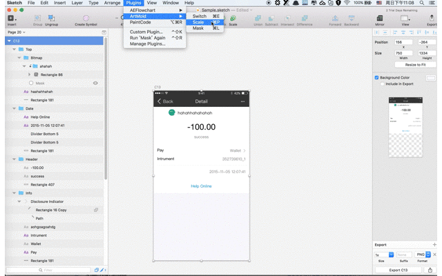

## Announcement

Sorry for stopping sharing for some  reason.

# ArtMold

ArtMold is a plugin for Sketch that helps you duplicate and scale the selected artboard with layers in the artboard resizing.You can  alse specify constraint masks  in some layer to control it flexible resizing or fixed .These constraints are relative to the parent, either a group or an artboard.

# Usage

## 1. Set Switch


## 2. Edit Masks
## 3. Scale Artboard 



# Installation
Make sure you have the latest version of Sketch 3 installed. (Sketch 3.3+)

1. Download the ZIP file of this repository
2. Double click on ```ArtMold-zh.sketchplugin``` for Chinese ; ``ArtMold-us.sketchplugin``` for English.


# Inspiration
- [Sketch Constraints](https://github.com/bouchenoiremarc/Sketch-Constraints)
- [Sketch Header](https://github.com/abynim/Sketch-Headers)
