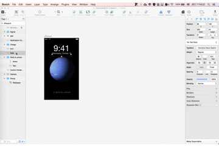

# Sketch Scale

Sketch Scale is a plugin that helps you duplicate and scale the selected artboard with layers in the artboard resizing.You can  alse specify constraint masks  in some layer to control it flexible resizing or fixed .These constraints are relative to the parent, either a group or an artboard.


# Usage
## Edit Masks

## Scale Artboard 


# Installation
Make sure you have the latest version of Sketch 3 installed. (Sketch 3.3+)

1. Download the ZIP file of this repository
2. Double click on ```Sketch Scale.sketchplugin```


# Notes 

- Only surpport zooming in the artboard  1.5 times.
- Specify constraint masks to make layer fixed . 

# Inspiration
- [Sketch Constraints](https://github.com/bouchenoiremarc/Sketch-Constraints)
- [Sketch Header](https://github.com/abynim/Sketch-Headers)